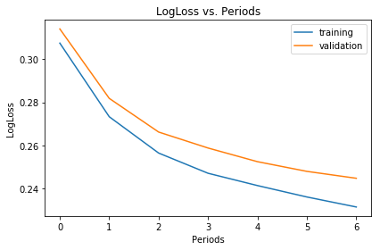
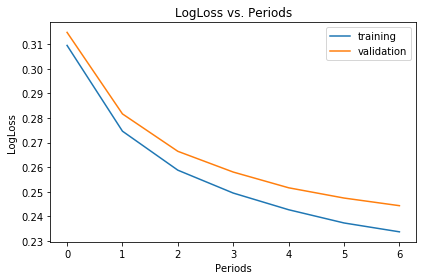

# 정규화 : 희소성

### 희소성을 위한 정규화 : L1 정규화

> * 희소 벡터는 종종 많은 차원을 포함하고, 특성 교차를 생성하면 더 많은 차원이 발생한다. 따라서, 고차원 특성 벡터가 주어지면 모델크기가 커지질 수 있고 <b>엄청난 양의 RAM 필요</b>하다. <br>
> * 가중치가 정확하게 0일 경우 모델에서 해당 특성을 삭제하므로, 고차원의 희소 벡터는 가중치를 정확하게 <b>0 으로 떨어지도록 유도</b>하는 것이 좋다. <br>
> * L2 정규화는 가중치를 작은 값으로 유도하지만, 정확히 0으로 만들지는 못한다.

<br>

##### L0 정규화

> 모델에서 0이 아닌 계수 값의 수에 페널티를 준다. <br>
> 하지만, 볼록하지 않은 최적화 문제(<b>NP-난해</b>)가 있다.

<br>

##### L1 정규화

> L0에 가가우면서도 <b>볼록</b>하다는 이점이 있다.

<br>

##### L1과 L2 비교

> 1. 서로 다른 방식으로 가중치에 페널티를 준다.
>  * L2 : 가중치의 제곱
>  * L1 : 가중치의 절대값
> 2. 결과적으로 서로 다르게 미분된다.
>  * L2 : 2 * 가중치
>  * L1 : 가중치와 무과한 상수 값

> * L2의 미분계수는 매번 가중치의 x%만큼 제거한다고 생각하면 된다. <br>
 따라서, 절대 0이 되지 않는다.
> * L1의 미분계수는 매번 가중치에서 일정 상수를 뺀다고 생각하면 된다. <br>
 절대값으로 인해 L1은 0에서 불연속성을 가지게 된다.

<br>

```python
from __future__ import print_function

import math

from IPython import display
from matplotlib import cm
from matplotlib import gridspec
from matplotlib import pyplot as plt
import numpy as np
import pandas as pd
from sklearn import metrics
import tensorflow as tf
from tensorflow.python.data import Dataset

tf.logging.set_verbosity(tf.logging.ERROR)
pd.options.display.max_rows = 10
pd.options.display.float_format = '{:.1f}'.format

california_housing_dataframe = pd.read_csv("https://dl.google.com/mlcc/mledu-datasets/california_housing_train.csv", sep=",")

california_housing_dataframe = california_housing_dataframe.reindex(
    np.random.permutation(california_housing_dataframe.index))
```


```python
def preprocess_features(california_housing_dataframe):
  """Prepares input features from California housing data set.
  
  Args:
    california_housing_dataframe: A Pandas DataFrame expected to contain data
      from the California housing data set.
  Returns:
    A DataFrame that contains the features to be used for the model, including
    synthetic features.
  """
  selected_features = california_housing_dataframe[
    ["latitude",
     "longitude",
     "housing_median_age",
     "total_rooms",
     "total_bedrooms",
     "population",
     "households",
     "median_income"]]
  processed_features = selected_features.copy()
  # Create a synthetic feature.
  processed_features["rooms_per_person"] = (
    california_housing_dataframe["total_rooms"] /
    california_housing_dataframe["population"])
  return processed_features

def preprocess_targets(california_housing_dataframe):
  """Prepares target features (i.e., labels) from California housing data set.
  
  Args:
    california_housing_dataframe: A Pandas DataFrame expected to contain data
      from the California housing data set.
  Returns:
    A DataFrame that contains the target feature.
  """
  output_targets = pd.DataFrame()
  # Create a boolean categorical feature representing whether the
  # medianHouseValue is above a set threshold.
  output_targets["median_house_value_is_high"] = (
    california_housing_dataframe["median_house_value"] > 265000).astype(float)
  return output_targets
```

<br> <br>

###### In
```python
# Choose the first 12000 (out of 17000) examples for training.
training_examples = preprocess_features(california_housing_dataframe.head(12000))
training_targets = preprocess_targets(california_housing_dataframe.head(12000))

# Choose the last 5000 (out of 17000) examples for validation.
validation_examples = preprocess_features(california_housing_dataframe.tail(5000))
validation_targets = preprocess_targets(california_housing_dataframe.tail(5000))

# Double-check that we've done the right thing.
print("Training examples summary:")
display.display(training_examples.describe())
print("Validation examples summary:")
display.display(validation_examples.describe())

print("Training targets summary:")
display.display(training_targets.describe())
print("Validation targets summary:")
display.display(validation_targets.describe())
```
###### Out
    Training examples summary:
    
<table>
    <tr>
      <th></th>
      <th>latitude</th>
      <th>longitude</th>
      <th>housing_median_age</th>
      <th>total_rooms</th>
      <th>total_bedrooms</th>
      <th>population</th>
      <th>households</th>
      <th>median_income</th>
      <th>rooms_per_person</th>
    </tr>
    <tr>
      <th>count</th>
      <td>12000.0</td>
      <td>12000.0</td>
      <td>12000.0</td>
      <td>12000.0</td>
      <td>12000.0</td>
      <td>12000.0</td>
      <td>12000.0</td>
      <td>12000.0</td>
      <td>12000.0</td>
    </tr>
    <tr>
      <th>mean</th>
      <td>35.6</td>
      <td>-119.6</td>
      <td>28.7</td>
      <td>2610.7</td>
      <td>533.2</td>
      <td>1418.5</td>
      <td>496.4</td>
      <td>3.9</td>
      <td>2.0</td>
    </tr>
    <tr>
      <th>std</th>
      <td>2.1</td>
      <td>2.0</td>
      <td>12.6</td>
      <td>2128.3</td>
      <td>416.6</td>
      <td>1153.4</td>
      <td>381.5</td>
      <td>1.9</td>
      <td>1.2</td>
    </tr>
    <tr>
      <th>min</th>
      <td>32.5</td>
      <td>-124.3</td>
      <td>1.0</td>
      <td>2.0</td>
      <td>1.0</td>
      <td>3.0</td>
      <td>1.0</td>
      <td>0.5</td>
      <td>0.0</td>
    </tr>
    <tr>
      <th>25%</th>
      <td>33.9</td>
      <td>-121.8</td>
      <td>18.0</td>
      <td>1453.0</td>
      <td>294.0</td>
      <td>785.0</td>
      <td>279.0</td>
      <td>2.6</td>
      <td>1.5</td>
    </tr>
    <tr>
      <th>50%</th>
      <td>34.2</td>
      <td>-118.5</td>
      <td>29.0</td>
      <td>2112.0</td>
      <td>430.0</td>
      <td>1158.0</td>
      <td>406.0</td>
      <td>3.6</td>
      <td>1.9</td>
    </tr>
    <tr>
      <th>75%</th>
      <td>37.7</td>
      <td>-118.0</td>
      <td>37.0</td>
      <td>3112.2</td>
      <td>642.0</td>
      <td>1708.5</td>
      <td>600.0</td>
      <td>4.8</td>
      <td>2.3</td>
    </tr>
    <tr>
      <th>max</th>
      <td>42.0</td>
      <td>-114.5</td>
      <td>52.0</td>
      <td>37937.0</td>
      <td>6445.0</td>
      <td>35682.0</td>
      <td>6082.0</td>
      <td>15.0</td>
      <td>52.0</td>
    </tr>
</table>

<br>

    Validation examples summary:
    
<table>
    <tr>
      <th></th>
      <th>latitude</th>
      <th>longitude</th>
      <th>housing_median_age</th>
      <th>total_rooms</th>
      <th>total_bedrooms</th>
      <th>population</th>
      <th>households</th>
      <th>median_income</th>
      <th>rooms_per_person</th>
    </tr>
    <tr>
      <th>count</th>
      <td>5000.0</td>
      <td>5000.0</td>
      <td>5000.0</td>
      <td>5000.0</td>
      <td>5000.0</td>
      <td>5000.0</td>
      <td>5000.0</td>
      <td>5000.0</td>
      <td>5000.0</td>
    </tr>
    <tr>
      <th>mean</th>
      <td>35.6</td>
      <td>-119.6</td>
      <td>28.4</td>
      <td>2722.9</td>
      <td>554.2</td>
      <td>1456.1</td>
      <td>512.7</td>
      <td>3.9</td>
      <td>2.0</td>
    </tr>
    <tr>
      <th>std</th>
      <td>2.1</td>
      <td>2.0</td>
      <td>12.7</td>
      <td>2297.5</td>
      <td>432.7</td>
      <td>1134.1</td>
      <td>391.5</td>
      <td>1.9</td>
      <td>1.1</td>
    </tr>
    <tr>
      <th>min</th>
      <td>32.5</td>
      <td>-124.2</td>
      <td>1.0</td>
      <td>15.0</td>
      <td>4.0</td>
      <td>9.0</td>
      <td>5.0</td>
      <td>0.5</td>
      <td>0.1</td>
    </tr>
    <tr>
      <th>25%</th>
      <td>33.9</td>
      <td>-121.8</td>
      <td>18.0</td>
      <td>1475.8</td>
      <td>306.0</td>
      <td>799.0</td>
      <td>288.0</td>
      <td>2.6</td>
      <td>1.5</td>
    </tr>
    <tr>
      <th>50%</th>
      <td>34.3</td>
      <td>-118.5</td>
      <td>28.0</td>
      <td>2168.0</td>
      <td>442.0</td>
      <td>1191.0</td>
      <td>416.0</td>
      <td>3.5</td>
      <td>2.0</td>
    </tr>
    <tr>
      <th>75%</th>
      <td>37.7</td>
      <td>-118.0</td>
      <td>37.0</td>
      <td>3215.2</td>
      <td>664.0</td>
      <td>1742.0</td>
      <td>617.0</td>
      <td>4.7</td>
      <td>2.3</td>
    </tr>
    <tr>
      <th>max</th>
      <td>42.0</td>
      <td>-114.3</td>
      <td>52.0</td>
      <td>30401.0</td>
      <td>4957.0</td>
      <td>15037.0</td>
      <td>4339.0</td>
      <td>15.0</td>
      <td>55.2</td>
    </tr>
</table>

<br>

    Training targets summary:
    
<table>
    <tr>
      <th></th>
      <th>median_house_value_is_high</th>
    </tr>
    <tr>
      <th>count</th>
      <td>12000.0</td>
    </tr>
    <tr>
      <th>mean</th>
      <td>0.3</td>
    </tr>
    <tr>
      <th>std</th>
      <td>0.4</td>
    </tr>
    <tr>
      <th>min</th>
      <td>0.0</td>
    </tr>
    <tr>
      <th>25%</th>
      <td>0.0</td>
    </tr>
    <tr>
      <th>50%</th>
      <td>0.0</td>
    </tr>
    <tr>
      <th>75%</th>
      <td>1.0</td>
    </tr>
    <tr>
      <th>max</th>
      <td>1.0</td>
    </tr>
</table>

<br>

    Validation targets summary:
    
<table>
    <tr>
      <th></th>
      <th>median_house_value_is_high</th>
    </tr>
    <tr>
      <th>count</th>
      <td>5000.0</td>
    </tr>
    <tr>
      <th>mean</th>
      <td>0.2</td>
    </tr>
    <tr>
      <th>std</th>
      <td>0.4</td>
    </tr>
    <tr>
      <th>min</th>
      <td>0.0</td>
    </tr>
    <tr>
      <th>25%</th>
      <td>0.0</td>
    </tr>
    <tr>
      <th>50%</th>
      <td>0.0</td>
    </tr>
    <tr>
      <th>75%</th>
      <td>0.0</td>
    </tr>
    <tr>
      <th>max</th>
      <td>1.0</td>
    </tr>
</table>

<br> <br>

```python
def my_input_fn(features, targets, batch_size=1, shuffle=True, num_epochs=None):
    """Trains a linear regression model of one feature.
    
    Args:
      features: pandas DataFrame of features
      targets: pandas DataFrame of targets
      batch_size: Size of batches to be passed to the model
      shuffle: True or False. Whether to shuffle the data.
      num_epochs: Number of epochs for which data should be repeated. None = repeat indefinitely
    Returns:
      Tuple of (features, labels) for next data batch
    """
  
    # Convert pandas data into a dict of np arrays.
    features = {key:np.array(value) for key,value in dict(features).items()}                                            
 
    # Construct a dataset, and configure batching/repeating
    ds = Dataset.from_tensor_slices((features,targets)) # warning: 2GB limit
    ds = ds.batch(batch_size).repeat(num_epochs)
    
    # Shuffle the data, if specified
    if shuffle:
      ds = ds.shuffle(10000)
    
    # Return the next batch of data
    features, labels = ds.make_one_shot_iterator().get_next()
    return features, labels
```


```python
def get_quantile_based_buckets(feature_values, num_buckets):
  quantiles = feature_values.quantile(
    [(i+1.)/(num_buckets + 1.) for i in range(num_buckets)])
  return [quantiles[q] for q in quantiles.keys()]
```


```python
def construct_feature_columns():
  """Construct the TensorFlow Feature Columns.
  
  Returns:
    A set of feature columns
  """

  bucketized_households = tf.feature_column.bucketized_column(
    tf.feature_column.numeric_column("households"),
    boundaries=get_quantile_based_buckets(training_examples["households"], 10))
  bucketized_longitude = tf.feature_column.bucketized_column(
    tf.feature_column.numeric_column("longitude"),
    boundaries=get_quantile_based_buckets(training_examples["longitude"], 50))
  bucketized_latitude = tf.feature_column.bucketized_column(
    tf.feature_column.numeric_column("latitude"),
    boundaries=get_quantile_based_buckets(training_examples["latitude"], 50))
  bucketized_housing_median_age = tf.feature_column.bucketized_column(
    tf.feature_column.numeric_column("housing_median_age"),
    boundaries=get_quantile_based_buckets(
      training_examples["housing_median_age"], 10))
  bucketized_total_rooms = tf.feature_column.bucketized_column(
    tf.feature_column.numeric_column("total_rooms"),
    boundaries=get_quantile_based_buckets(training_examples["total_rooms"], 10))
  bucketized_total_bedrooms = tf.feature_column.bucketized_column(
    tf.feature_column.numeric_column("total_bedrooms"),
    boundaries=get_quantile_based_buckets(training_examples["total_bedrooms"], 10))
  bucketized_population = tf.feature_column.bucketized_column(
    tf.feature_column.numeric_column("population"),
    boundaries=get_quantile_based_buckets(training_examples["population"], 10))
  bucketized_median_income = tf.feature_column.bucketized_column(
    tf.feature_column.numeric_column("median_income"),
    boundaries=get_quantile_based_buckets(training_examples["median_income"], 10))
  bucketized_rooms_per_person = tf.feature_column.bucketized_column(
    tf.feature_column.numeric_column("rooms_per_person"),
    boundaries=get_quantile_based_buckets(
      training_examples["rooms_per_person"], 10))

  long_x_lat = tf.feature_column.crossed_column(
    set([bucketized_longitude, bucketized_latitude]), hash_bucket_size=1000)

  feature_columns = set([
    long_x_lat,
    bucketized_longitude,
    bucketized_latitude,
    bucketized_housing_median_age,
    bucketized_total_rooms,
    bucketized_total_bedrooms,
    bucketized_population,
    bucketized_households,
    bucketized_median_income,
    bucketized_rooms_per_person])
  
  return feature_columns
```


```python
def model_size(estimator):
  variables = estimator.get_variable_names()
  size = 0
  for variable in variables:
    if not any(x in variable 
               for x in ['global_step',
                         'centered_bias_weight',
                         'bias_weight',
                         'Ftrl']
              ):
      size += np.count_nonzero(estimator.get_variable_value(variable))
  return size
```


```python
def train_linear_classifier_model(
    learning_rate,
    regularization_strength,
    steps,
    batch_size,
    feature_columns,
    training_examples,
    training_targets,
    validation_examples,
    validation_targets):
  """Trains a linear regression model. 
  
  In addition to training, this function also prints training progress information,
  as well as a plot of the training and validation loss over time.
  
  Args:
    learning_rate: A `float`, the learning rate.
    regularization_strength: A `float` that indicates the strength of the L1
       regularization. A value of `0.0` means no regularization.
    steps: A non-zero `int`, the total number of training steps. A training step
      consists of a forward and backward pass using a single batch.
    feature_columns: A `set` specifying the input feature columns to use.
    training_examples: A `DataFrame` containing one or more columns from
      `california_housing_dataframe` to use as input features for training.
    training_targets: A `DataFrame` containing exactly one column from
      `california_housing_dataframe` to use as target for training.
    validation_examples: A `DataFrame` containing one or more columns from
      `california_housing_dataframe` to use as input features for validation.
    validation_targets: A `DataFrame` containing exactly one column from
      `california_housing_dataframe` to use as target for validation.
      
  Returns:
    A `LinearClassifier` object trained on the training data.
  """

  periods = 7
  steps_per_period = steps / periods

  # Create a linear classifier object.
  my_optimizer = tf.train.FtrlOptimizer(learning_rate=learning_rate, l1_regularization_strength=regularization_strength)
  my_optimizer = tf.contrib.estimator.clip_gradients_by_norm(my_optimizer, 5.0)
  linear_classifier = tf.estimator.LinearClassifier(
      feature_columns=feature_columns,
      optimizer=my_optimizer
  )
  
  # Create input functions.
  training_input_fn = lambda: my_input_fn(training_examples, 
                                          training_targets["median_house_value_is_high"], 
                                          batch_size=batch_size)
  predict_training_input_fn = lambda: my_input_fn(training_examples, 
                                                  training_targets["median_house_value_is_high"], 
                                                  num_epochs=1, 
                                                  shuffle=False)
  predict_validation_input_fn = lambda: my_input_fn(validation_examples, 
                                                    validation_targets["median_house_value_is_high"], 
                                                    num_epochs=1, 
                                                    shuffle=False)
  
  # Train the model, but do so inside a loop so that we can periodically assess
  # loss metrics.
  print("Training model...")
  print("LogLoss (on validation data):")
  training_log_losses = []
  validation_log_losses = []
  for period in range (0, periods):
    # Train the model, starting from the prior state.
    linear_classifier.train(
        input_fn=training_input_fn,
        steps=steps_per_period
    )
    # Take a break and compute predictions.
    training_probabilities = linear_classifier.predict(input_fn=predict_training_input_fn)
    training_probabilities = np.array([item['probabilities'] for item in training_probabilities])
    
    validation_probabilities = linear_classifier.predict(input_fn=predict_validation_input_fn)
    validation_probabilities = np.array([item['probabilities'] for item in validation_probabilities])
    
    # Compute training and validation loss.
    training_log_loss = metrics.log_loss(training_targets, training_probabilities)
    validation_log_loss = metrics.log_loss(validation_targets, validation_probabilities)
    # Occasionally print the current loss.
    print("  period %02d : %0.2f" % (period, validation_log_loss))
    # Add the loss metrics from this period to our list.
    training_log_losses.append(training_log_loss)
    validation_log_losses.append(validation_log_loss)
  print("Model training finished.")

  # Output a graph of loss metrics over periods.
  plt.ylabel("LogLoss")
  plt.xlabel("Periods")
  plt.title("LogLoss vs. Periods")
  plt.tight_layout()
  plt.plot(training_log_losses, label="training")
  plt.plot(validation_log_losses, label="validation")
  plt.legend()

  return linear_classifier
```


```python
def train_linear_classifier_model(
    learning_rate,
    regularization_strength,
    steps,
    batch_size,
    feature_columns,
    training_examples,
    training_targets,
    validation_examples,
    validation_targets):
  """Trains a linear regression model.
  
  In addition to training, this function also prints training progress information,
  as well as a plot of the training and validation loss over time.
  
  Args:
    learning_rate: A `float`, the learning rate.
    regularization_strength: A `float` that indicates the strength of the L1
       regularization. A value of `0.0` means no regularization.
    steps: A non-zero `int`, the total number of training steps. A training step
      consists of a forward and backward pass using a single batch.
    feature_columns: A `set` specifying the input feature columns to use.
    training_examples: A `DataFrame` containing one or more columns from
      `california_housing_dataframe` to use as input features for training.
    training_targets: A `DataFrame` containing exactly one column from
      `california_housing_dataframe` to use as target for training.
    validation_examples: A `DataFrame` containing one or more columns from
      `california_housing_dataframe` to use as input features for validation.
    validation_targets: A `DataFrame` containing exactly one column from
      `california_housing_dataframe` to use as target for validation.
      
  Returns:
    A `LinearClassifier` object trained on the training data.
  """

  periods = 7
  steps_per_period = steps / periods

  # Create a linear classifier object.
  my_optimizer = tf.train.FtrlOptimizer(learning_rate=learning_rate, l1_regularization_strength=regularization_strength)
  my_optimizer = tf.contrib.estimator.clip_gradients_by_norm(my_optimizer, 5.0)
  linear_classifier = tf.estimator.LinearClassifier(
      feature_columns=feature_columns,
      optimizer=my_optimizer
  )
  
  # Create input functions.
  training_input_fn = lambda: my_input_fn(training_examples, 
                                          training_targets["median_house_value_is_high"], 
                                          batch_size=batch_size)
  predict_training_input_fn = lambda: my_input_fn(training_examples, 
                                                  training_targets["median_house_value_is_high"], 
                                                  num_epochs=1, 
                                                  shuffle=False)
  predict_validation_input_fn = lambda: my_input_fn(validation_examples, 
                                                    validation_targets["median_house_value_is_high"], 
                                                    num_epochs=1, 
                                                    shuffle=False)
  
  # Train the model, but do so inside a loop so that we can periodically assess
  # loss metrics.
  print("Training model...")
  print("LogLoss (on validation data):")
  training_log_losses = []
  validation_log_losses = []
  for period in range (0, periods):
    # Train the model, starting from the prior state.
    linear_classifier.train(
        input_fn=training_input_fn,
        steps=steps_per_period
    )
    # Take a break and compute predictions.
    training_probabilities = linear_classifier.predict(input_fn=predict_training_input_fn)
    training_probabilities = np.array([item['probabilities'] for item in training_probabilities])
    
    validation_probabilities = linear_classifier.predict(input_fn=predict_validation_input_fn)
    validation_probabilities = np.array([item['probabilities'] for item in validation_probabilities])
    
    # Compute training and validation loss.
    training_log_loss = metrics.log_loss(training_targets, training_probabilities)
    validation_log_loss = metrics.log_loss(validation_targets, validation_probabilities)
    # Occasionally print the current loss.
    print("  period %02d : %0.2f" % (period, validation_log_loss))
    # Add the loss metrics from this period to our list.
    training_log_losses.append(training_log_loss)
    validation_log_losses.append(validation_log_loss)
  print("Model training finished.")

  # Output a graph of loss metrics over periods.
  plt.ylabel("LogLoss")
  plt.xlabel("Periods")
  plt.title("LogLoss vs. Periods")
  plt.tight_layout()
  plt.plot(training_log_losses, label="training")
  plt.plot(validation_log_losses, label="validation")
  plt.legend()

  return linear_classifier
```

<br> <br>

###### In
```python
linear_classifier = train_linear_classifier_model(
    learning_rate=0.1,
    # TWEAK THE REGULARIZATION VALUE BELOW
    regularization_strength=0.0,
    steps=300,
    batch_size=100,
    feature_columns=construct_feature_columns(),
    training_examples=training_examples,
    training_targets=training_targets,
    validation_examples=validation_examples,
    validation_targets=validation_targets)
print("Model size:", model_size(linear_classifier))
```
###### Out
    Training model...
    LogLoss (on validation data):
      period 00 : 0.31
      period 01 : 0.28
      period 02 : 0.27
      period 03 : 0.26
      period 04 : 0.25
      period 05 : 0.25
      period 06 : 0.24
    Model training finished.
    Model size: 788
    





<br>

###### In
```python
linear_classifier = train_linear_classifier_model(
    learning_rate=0.1,
    regularization_strength=0.1,
    steps=300,
    batch_size=100,
    feature_columns=construct_feature_columns(),
    training_examples=training_examples,
    training_targets=training_targets,
    validation_examples=validation_examples,
    validation_targets=validation_targets)
print("Model size:", model_size(linear_classifier))
```
###### Out
    Training model...
    LogLoss (on validation data):
      period 00 : 0.31
      period 01 : 0.28
      period 02 : 0.27
      period 03 : 0.26
      period 04 : 0.25
      period 05 : 0.25
      period 06 : 0.24
    Model training finished.
    Model size: 747
    




